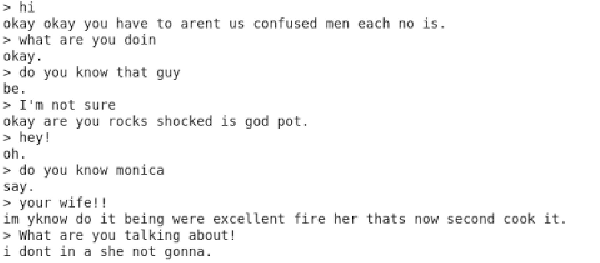

# A Chatbot talked like Chandler and Angry Chandler (Friends)

Build chatbot use Keras Seq2seq model

## Data Processing
Download [friends scripts](https://fangj.github.io/friends/), processing the data.

1. For finding the conversation talked by Chandler, I used the following strategy.
I found that if a scene has many people, and one wants to talk to Chandler, not other people, it will have a "(to Chandler)" in the sentence. But there may be many "(to XXX)"in one sentence, so I cut the other part, and only reserve the "talk to Chandler" part sentence and found the next Chandler answer as one pair of QA.

2. If someone says something and then Chandler says something, I will reserve this kind of conversation. Although it may have some errors. (For example, They are answering the same question asked by some other people.) But I still consider this strategy is worked. Because most of these conversations are one talking to Chandler, and although there may have some errors, the two sentences must have the same topic.

3. If Chandler's sentence is the first sentence of a scene, I will strip this sentence.
For angry Chandler part, I use [DepecheMood++](https://github.com/marcoguerini/DepecheMood) to find the angry score of all my QA sentences.

The steps are as follows:

1. According to the DM++ data, I got a dict of almost all the word and their angry score.

2. By using this dict, I can calculate all the Answer's angry score by calculating the sum of all the word's angry score. But at this time I found that if a sentence is very long, then it's angry score will high either. So I limited the sentence's length and find the sentences whose angry score is higher than 0.55.

3. But at this time, there is another question, which is that the number of sentences is too few. So I add some other corpus(From [Chatterbot-corpus](https://github.com/gunthercox/chatterbot-corpus)). And do the same thing to find high angry score sentences. 

I use these two datasets to train my two models and get two versions of Chandler.

## Word Embedding
The word embedding part is based on the One-Hot representation of the word bag (BOW). In this way, the words in the vocabulary are arranged in a column. For a word A, if it appears in the lexical sequence as k, then its vector representation is "the kth bit is 1, and the other positions are A vector of 0 ”.

But when I load all the data and try to build a Three-dimensional matrix, it will have memory error on my computer (also on google colab). So I have to sacrifice some data to build the matrix.

Actually, I more want to use word2vec to do the word embedding. But the thing is, I know how to convert a sentence to vector, but I don't know how to convert a vector to sentence. So I didn't use this method.I use these two datasets to train my two models and get two versions of Chandler.

## Deep Learning Approach 

Use seq2seq model to train the model, and base on Keras [seq2seq sample](https://github.com/keras-team/keras/blob/master/examples/lstm_seq2seq.py). 

## Result 

